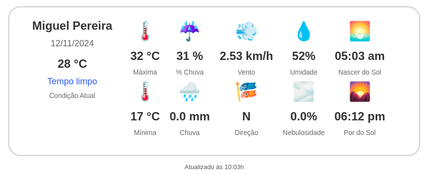

# Alerta Clima (Weather Notifier)

## Objetivo

Desenvolver uma solução automatizada de notificação climática que forneça dados atualizados e específicos para as principais cidades do Vale do Café e a cidade do Rio de Janeiro, com o objetivo de apoiar o planejamento diário de atividades e a segurança de moradores, empresas e gestores públicos da região. A ferramenta pode enviar previsões meteorológicas diárias por e-mail, permitindo uma preparação melhorada para condições adversas e ajudando a otimizar as atividades econômicas locais, como a agricultura e o turismo. O projeto busca consolidar informações críticas em um único sistema acessível e escalável. Este projeto tem o potencial de fortalecer a resiliência das comunidades ao clima e promover a produtividade regional.

### Benefícios

- Apoio ao Planejamento Econômico Local: A região do Vale do Café possui atividades agrícolas e turísticas que dependem fortemente das condições climáticas. Informações diárias ajudam agricultores e operadores turísticos a antecipar e ajustar atividades, reduzindo prejuízos.
- Resiliência Comunitária e Segurança Pública: Previsões para a cidade do Rio de Janeiro e para as principais cidades do Vale do Café ajudarão gestores públicos e moradores a se preparar para condições adversas, como chuvas intensas, calor extremo ou outros eventos que impactam o cotidiano e a segurança.
- Centralização e Acessibilidade das Informações: Consolidar dados de diversas cidades em um único sistema, que os distribui de forma automatizada, facilita o acesso às informações e diminui a dependência de verificações manuais.
- Escalabilidade e Flexibilidade: A solução pode ser adaptada para incluir mais cidades ou enviar informações em diferentes horários, aumentando seu impacto ao longo do tempo.

## Como funciona

O projeto "Weather Notifier" funciona como uma solução automatizada que coleta dados climáticos de diversas cidades no Vale do Café - RJ e da cidade do Rio de Janeiro, e envia essas informações por e-mail aos usuários registrados. Ele tem como objetivo fornecer previsões precisas e oportunas para ajudar no planejamento de atividades e na tomada de decisões relacionadas às condições climáticas. Para maiores detalhes clique em [saiba mais](./weather_notifier/README.md).




Os pârametros informados enviadas aos usuários são:

- Temperatura Atual
- Condição climática Atual
- Temperatura Maxima (°C)
- Temperatura Minima (°C)
- Probabilidade de Chuva (%)
- Nivel de Chuva (mm)
- Velocidade do vento (km/h)
- Direção do vento
- Humidade do Ar (%)
- Nebulosidade (%)
- Horário: Nascer do Sol
- Horário: Por do Sol
- Horário de medição da temperatura


## Estrutura do Projeto


    weather_notifier/
    ├── config/
    │   ├── cities.json               # Lista de cidades com nome e estado
    │   ├── email_template.json       # Template detalhado do e-mail
    │   ├── html_template.html        # Template do visual climatico em html
    │   ├── settings.py               # Configurações principais do projeto
    │   └── users.json                # Lista de usuários com e-mail e nome
    ├── weather_notifier/
    │   ├── __init__.py
    │   ├── email_service.py          # Módulo simplificado para enviar e-mails
    │   ├── visual_service.py         # Renderiza o visual html com os parâmetros climáticos antes de enviar e-mails
    │   └── weather_service.py        # Módulo para acessar a API e processar os dados do clima
    ├── main.py                       # Arquivo principal para executar o projeto
    ├── requirements.txt              # Dependências do projeto
    └── README.md                     # Instruções sobre o projeto


### Detalhes

- **config/settings.py**: Contém as configurações do projeto, como informações de e-mail e da API.
- **config/users.json**: Armazena a lista de usuários para quem os e-mails serão enviados.
- **config/cities.json**: Contém a lista de cidades que serão consultadas na API.
- **config/email_template.json**: Template com o título e o corpo do e-mail em português.
- **config/html_template.html**: Template do visual climatico em html.
- **weather_notifier/weather_service.py**: Faz a consulta na API e coleta os parâmetros de interesse para cada cidade.
- **weather_notifier/email_service.py**: Envia os e-mails, personalizando o corpo com informações de cada cidade.
- **weather_notifier/visual_service.py**: Renderiza o visual html com os parâmetros climáticos.
- **requirements.txt**: Arquivo com as dependências.
- **main.py**: Script principal que coordena a execução do projeto.


### Proteção de dados sensíveis

Para proteger credenciais, como API_KEY e EMAIL_PASSWORD usamos um arquivo .env com a biblioteca python-dotenv. A seguir, estão os passos para aplicar a protação das credenciais:

1. **Instale a biblioteca `python-dotenv`**:
   ```bash
   pip install python-dotenv
   ```

2. **Crie um arquivo `.env`** na raiz do projeto e adicione suas variáveis:
   ```plaintext
   API_KEY=sua_chave_secreta
   EMAIL_PASSWORD=seu_email_password
   ```

3. **No código Python**, carregue as variáveis do `.env` e acesse-as:
   ```python
   from dotenv import load_dotenv
   import os

   load_dotenv()  # Carrega as variáveis do arquivo .env

   API_KEY = os.getenv("API_KEY")
   EMAIL_PASSWORD = os.getenv("EMAIL_PASSWORD")
   ```

Esses passos protegem suas variáveis sensíveis, mantendo-as fora do código e do repositório.

## Como executar o software

**Como Executar**

Aqui descrevemos como configurar e executar o projeto Alerta Clima para enviar notificações de clima personalizadas via e-mail.

### 1. Pré-requisitos

- **Python** >= 3.10 instalado
- **Bibliotecas**: Instale as bibliotecas necessárias com o seguinte comando:
- 
  ```bash
  pip install -r requirements.txt
  ```

- **Configuração do .env**: Crie um arquivo `.env` na raiz do projeto e adicione as variáveis sensíveis, como `API_KEY` e `EMAIL_PASSWORD`, para garantir segurança e fácil configuração.

### 2. Configuração do Projeto

- **Arquivo de Configuração** (`config/settings.py`): Verifique se as configurações no arquivo `settings.py` estão corretas, especialmente as que indicam os caminhos dos templates de e-mail, arquivos de usuários e a URL da API de clima.
  
- **Arquivo de Usuários** (`users.json`): No diretório configurado, crie um arquivo `users.json` no seguinte formato para especificar os destinatários:
  
  ```json
  {
    "users": [
      { "nome": "Nome do Usuário", "email": "email@exemplo.com" },
      ...
    ]
  }
  ```

- **Arquivo Template de E-mail** (`email_template.json`): Este arquivo define o formato e o conteúdo dos e-mails.
  

### 3. Execução do Projeto

1. **Obter Dados da API e Enviar E-mails**:
   Para iniciar a automação de envio de e-mails com as informações climáticas, execute:
  
   ```bash
   python main.py
   ```

2. **Verificar Saída**: Os e-mails serão enviados para os usuários configurados no `users.json`, e mensagens de log no terminal indicarão o status de cada envio.

### 4. Dicas Adicionais

- **Agendamento Automático**: Para enviar as notificações automaticamente em horários específicos, utilize uma ferramenta como `cron` no Linux ou o Agendador de Tarefas no Windows.
  

-----------------------


### Fonte API

**https://hgbrasil.com/status/weather**


